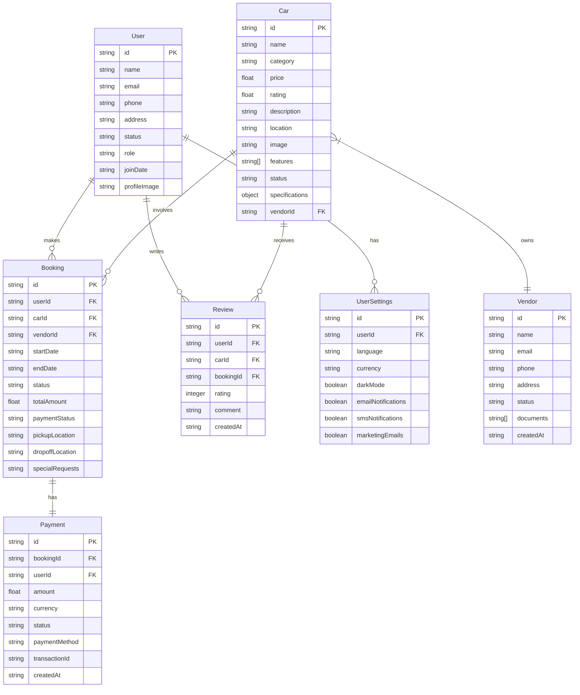

# Backend API Architecture & Database Mapping

## Database Schema Relationships



## API Endpoints Structure

### Authentication Routes
```
POST /api/auth/login
├── Validates credentials
└── Returns JWT token + user data

POST /api/auth/register
├── Creates new user
└── Returns user data

POST /api/auth/otp/send
├── Sends OTP to phone
└── Returns verification ID

POST /api/auth/otp/verify
├── Verifies OTP
└── Returns JWT token + user data
```

### User Routes
```
GET /api/users/me
├── Returns current user data
└── Includes settings

PUT /api/users/me
├── Updates user profile
└── Returns updated data

GET /api/users/:id
├── Returns user data
└── Requires admin role

PUT /api/users/:id/status
├── Updates user status
└── Requires admin role
```

### Car Routes
```
GET /api/cars
├── Lists all cars
├── Supports filtering & pagination
└── Optional: includes vendor details

POST /api/cars
├── Creates new car listing
├── Requires vendor role
└── Validates specifications

GET /api/cars/:id
├── Returns car details
├── Includes availability
└── Includes reviews

PUT /api/cars/:id
├── Updates car details
└── Requires owner/admin

DELETE /api/cars/:id
├── Soft deletes car
└── Requires owner/admin
```

### Booking Routes
```
GET /api/bookings
├── Lists user bookings
└── Supports filtering & pagination

POST /api/bookings
├── Creates booking
├── Validates availability
└── Initiates payment

GET /api/bookings/:id
├── Returns booking details
├── Includes car & user
└── Includes payment status

PUT /api/bookings/:id/status
├── Updates booking status
└── Triggers notifications
```

### Payment Routes
```
POST /api/payments
├── Processes payment
├── Updates booking status
└── Sends confirmation

GET /api/payments/:id
├── Returns payment details
└── Includes transaction data

POST /api/payments/:id/refund
├── Processes refund
├── Updates booking status
└── Sends notification
```

### Vendor Routes
```
POST /api/vendors/register
├── Creates vendor account
└── Validates documents

GET /api/vendors/:id/cars
├── Lists vendor's cars
└── Includes booking stats

GET /api/vendors/:id/bookings
├── Lists vendor's bookings
└── Includes payment status

PUT /api/vendors/:id/documents
├── Updates vendor documents
└── Validates file types
```

## Security Implementation

### Authentication Flow


### Request Authorization


## Data Flow Architecture

### Booking Process


## System Architecture

### High-Level Overview
```mermaid
graph TD
    Client[Client Applications] --> API[API Gateway]
    API --> Auth[Auth Service]
    API --> Cars[Car Service]
    API --> Book[Booking Service]
    API --> Pay[Payment Service]
    API --> Notif[Notification Service]
    
    Auth --> DB[(Database)]
    Cars --> DB
    Book --> DB
    Pay --> DB
    
    Pay --> External[Payment Gateway]
    Notif --> Email[Email Service]
    Notif --> SMS[SMS Service]
