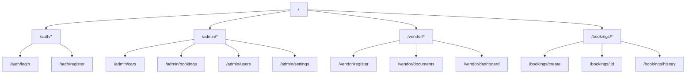
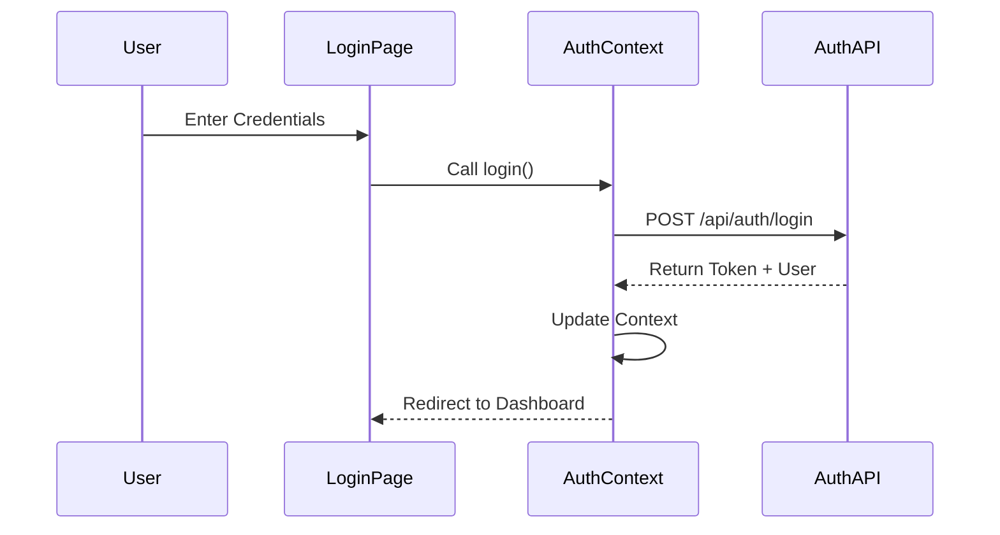
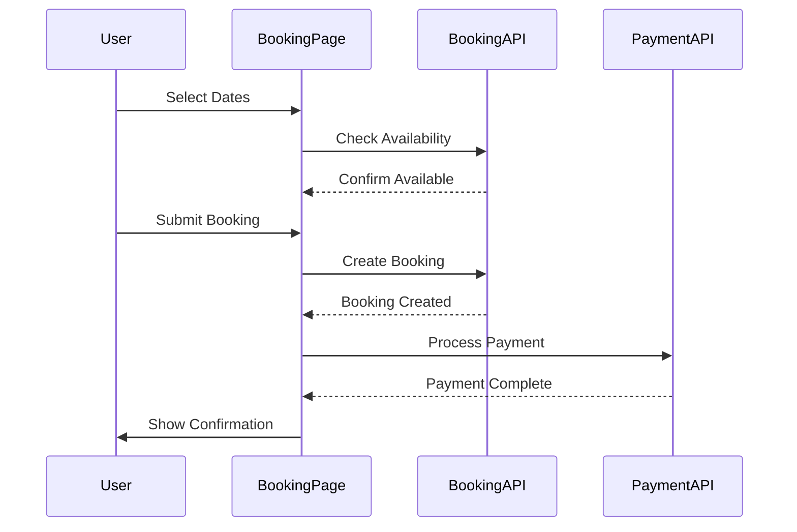

# Frontend Architecture Documentation

## Directory Structure

```
app/
├── page.tsx              # Home page
├── layout.tsx            # Root layout
├── auth/                # Authentication pages
│   ├── login/          
│   └── register/       
├── admin/               # Admin dashboard
│   ├── cars/
│   ├── bookings/
│   ├── users/
│   └── settings/
├── vendor/              # Vendor portal
│   ├── register/
│   ├── documents/
│   └── dashboard/
└── bookings/            # Booking management

components/
├── ui/                  # Base UI components
└── shared/              # Shared components

lib/
├── auth-service.ts      # Authentication logic
└── utils.ts            # Utility functions

types/                   # TypeScript definitions
styles/                  # Global styles
```

## Page Structure & Routing



## Component Architecture

### UI Components

```typescript
// Example Button Component
interface ButtonProps {
  variant?: 'primary' | 'secondary' | 'outline'
  size?: 'sm' | 'md' | 'lg'
  disabled?: boolean
  loading?: boolean
  onClick?: () => void
  children: React.ReactNode
}

// Example Form Component
interface FormProps {
  onSubmit: (data: any) => void
  initialValues?: Record<string, any>
  validation?: Record<string, (value: any) => string | undefined>
  children: React.ReactNode
}
```

### Layout Components

```typescript
// Page Layout
interface PageLayoutProps {
  title?: string
  description?: string
  children: React.ReactNode
}

// Dashboard Layout
interface DashboardLayoutProps {
  sidebar?: boolean
  header?: boolean
  children: React.ReactNode
}
```

## State Management

### Authentication State
```typescript
interface AuthState {
  user: User | null
  token: string | null
  loading: boolean
  error: string | null
}

interface AuthContextValue {
  state: AuthState
  login: (credentials: LoginRequest) => Promise<void>
  logout: () => void
  register: (data: RegisterRequest) => Promise<void>
}
```

### Form Handling
```typescript
interface FormState<T> {
  values: T
  errors: Partial<Record<keyof T, string>>
  touched: Partial<Record<keyof T, boolean>>
  isSubmitting: boolean
}

interface FormActions<T> {
  setFieldValue: (field: keyof T, value: any) => void
  setFieldTouched: (field: keyof T, touched: boolean) => void
  resetForm: () => void
  submitForm: () => Promise<void>
}
```

## Page Components

### Home Page
```typescript
// page.tsx
export default function HomePage() {
  return (
    <PageLayout>
      <HeroSection />
      <FeaturedCars />
      <HowItWorks />
      <Testimonials />
    </PageLayout>
  )
}
```

### Car Listing Page
```typescript
// cars/page.tsx
export default function CarsPage() {
  return (
    <PageLayout>
      <SearchFilters />
      <CarGrid>
        {cars.map(car => (
          <CarCard key={car.id} car={car} />
        ))}
      </CarGrid>
      <Pagination />
    </PageLayout>
  )
}
```

## Key Features Implementation

### Authentication Flow


### Booking Flow


## UI Components Library

The application uses a custom UI component library built with Tailwind CSS:

### Basic Components
- Button
- Input
- Select
- Checkbox
- Radio
- TextArea

### Form Components
- Form
- FormField
- FormLabel
- FormError
- FormHelperText

### Data Display
- Table
- Card
- Badge
- Avatar
- Modal
- Tooltip

### Navigation
- Navbar
- Sidebar
- Breadcrumb
- Tabs
- Pagination

### Feedback
- Alert
- Toast
- Progress
- Spinner
- Skeleton

## Responsive Design

The application follows a mobile-first approach with the following breakpoints:

```scss
// Breakpoints
$breakpoints: (
  'sm': '640px',   // Mobile
  'md': '768px',   // Tablet
  'lg': '1024px',  // Desktop
  'xl': '1280px',  // Large Desktop
  '2xl': '1536px'  // Extra Large
);
```

## Performance Optimization

1. **Code Splitting**
   - Dynamic imports for routes
   - Lazy loading for heavy components
   - Route-based chunking

2. **Image Optimization**
   - Next.js Image component
   - Responsive images
   - WebP format support

3. **State Management**
   - Local state when possible
   - Context for shared state
   - Memoization for expensive computations

4. **Caching Strategy**
   - API response caching
   - Static page generation
   - Incremental Static Regeneration

## Development Guidelines

### Component Creation
1. Create components in appropriate directory
2. Export from index file
3. Include TypeScript types
4. Add prop validation
5. Include documentation
6. Write unit tests

### Styling
1. Use Tailwind CSS classes
2. Follow mobile-first approach
3. Maintain consistent spacing
4. Use design tokens
5. Ensure accessibility

### State Management
1. Use local state for UI
2. Context for shared state
3. Props for parent-child communication
4. Custom hooks for complex logic

### Testing
1. Unit tests for components
2. Integration tests for pages
3. E2E tests for critical flows
4. Accessibility testing
5. Performance testing
