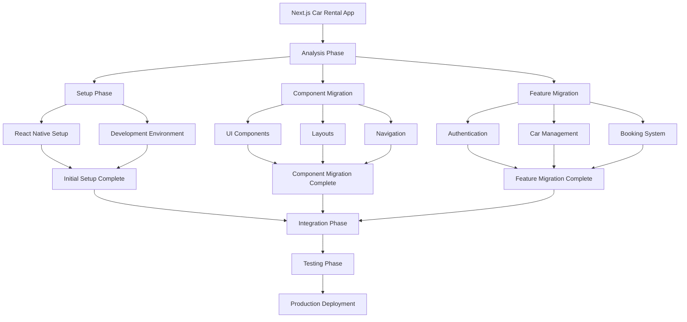
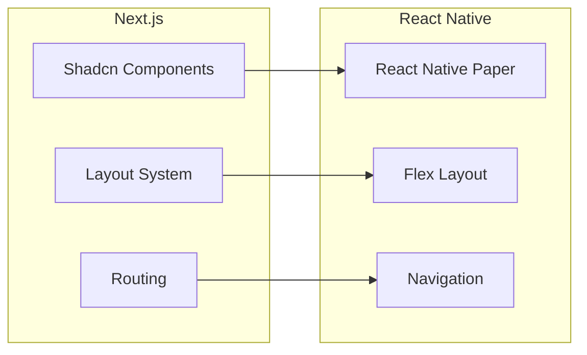
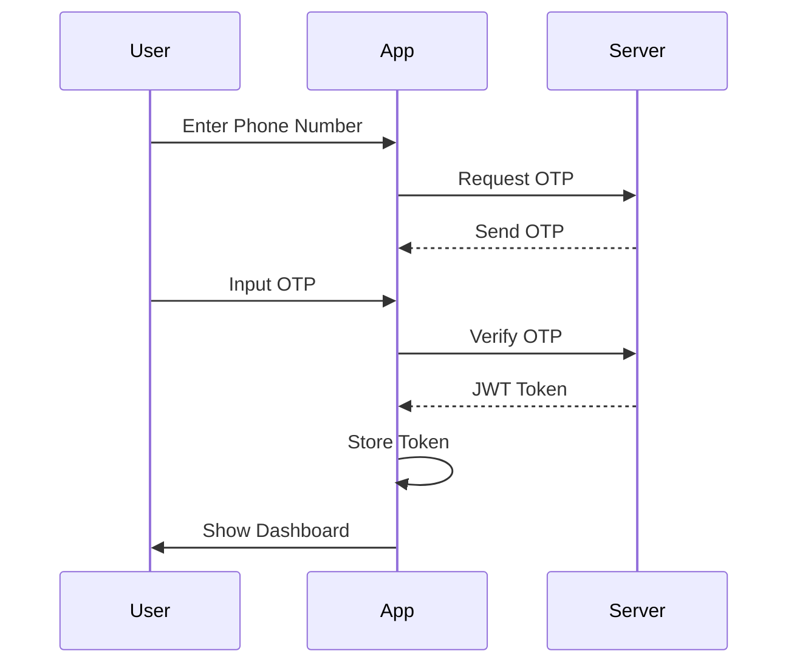
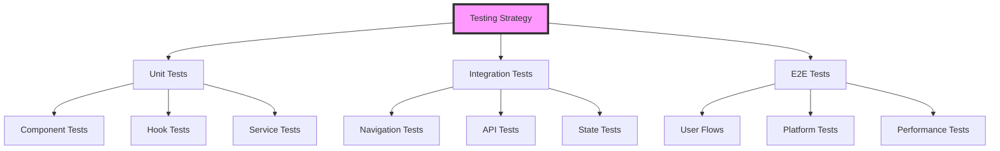
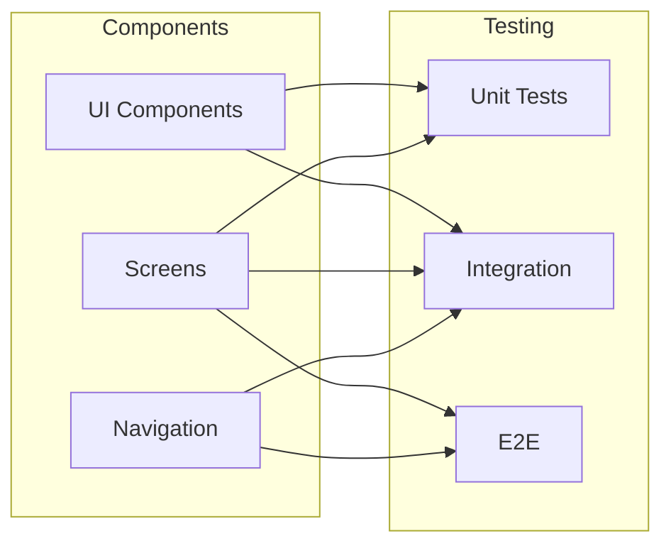
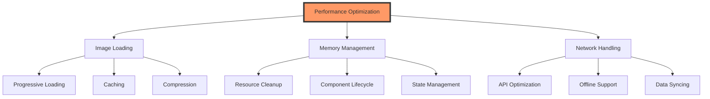
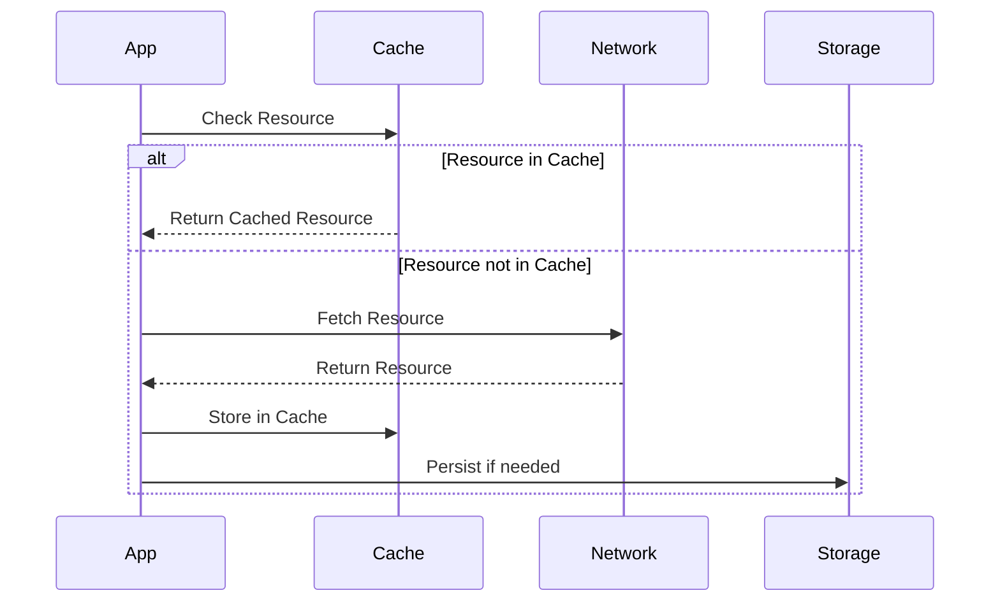
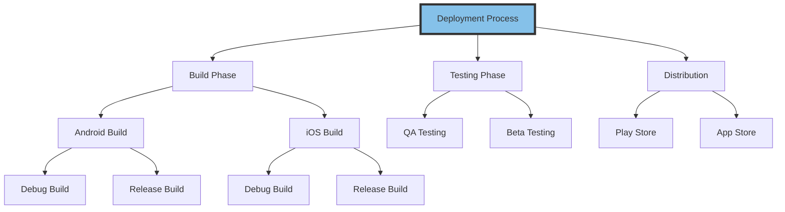
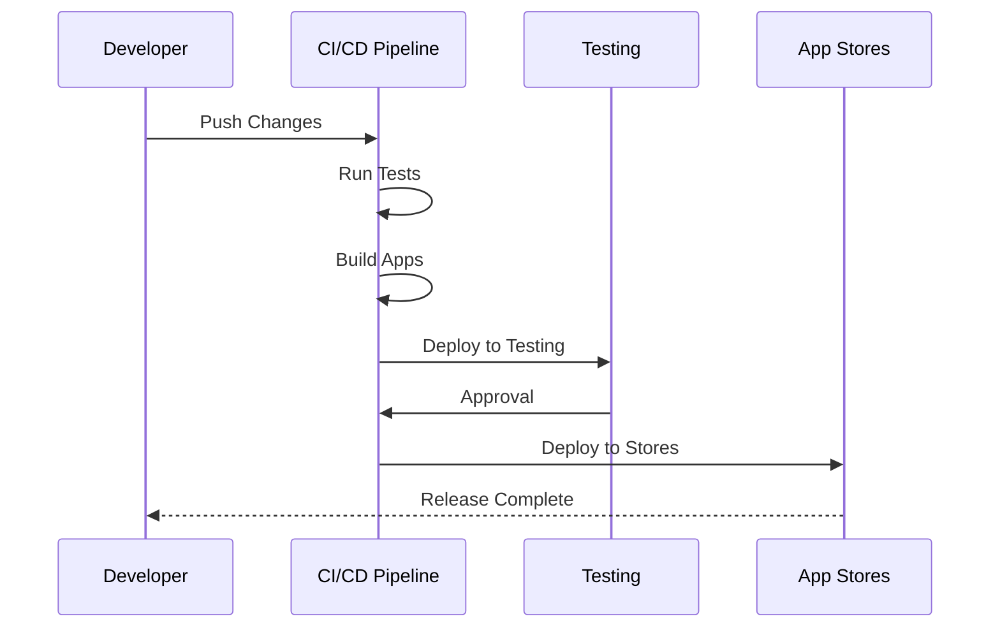

# Next.js to React Native Migration Documentation

## Table of Contents
1. [Project Overview](#project-overview)
2. [Migration Strategy](#migration-strategy)
3. [Technical Implementation](#technical-implementation)
4. [Testing & Quality Assurance](#testing--quality-assurance)
5. [Performance Optimization](#performance-optimization)
6. [Deployment](#deployment)

## Project Overview

### Current Architecture
The car rental application is currently built with:
- Next.js 14 (App Router)
- TypeScript
- TailwindCSS
- Shadcn/ui Components
- Capacitor for mobile integration

### Target Architecture
The new React Native application will use:
- React Native CLI
- TypeScript
- React Native Paper/Native Base for UI
- React Navigation
- React Native AsyncStorage
- Native Modules Integration

## Migration Strategy

### High-Level Migration Process



### Component Migration Flow



### Authentication Flow



### Phase 1: Setup & Infrastructure

#### Development Environment Setup
```bash
# Initialize new React Native project
npx @react-native-community/cli init CarRentalApp --template react-native-template-typescript

# Install essential dependencies
npm install @react-navigation/native @react-navigation/stack @react-navigation/bottom-tabs
npm install @react-native-async-storage/async-storage
npm install react-native-paper
npm install react-native-vector-icons
npm install react-native-maps
```

#### Project Structure
```
src/
├── components/         # Reusable UI components
├── screens/           # Screen components
├── navigation/        # Navigation configuration
├── services/          # API and business logic
├── hooks/             # Custom hooks
├── utils/            # Utility functions
├── assets/           # Images, fonts, etc.
└── types/            # TypeScript definitions
```

### Phase 2: Component Migration

#### UI Components Conversion Guide

1. **From Shadcn/ui to React Native Paper**

```typescript
// Next.js Button Component
<Button variant="outline" onClick={handleClick}>
  Click me
</Button>

// React Native Equivalent
<Button mode="outlined" onPress={handlePress}>
  Click me
</Button>
```

2. **Layout Conversion**

```typescript
// Next.js Layout
<div className="flex flex-col p-4">
  <header className="mb-4">...</header>
  <main className="flex-1">...</main>
</div>

// React Native Equivalent
<View style={styles.container}>
  <View style={styles.header}>...</View>
  <View style={styles.main}>...</View>
</View>

const styles = StyleSheet.create({
  container: {
    flex: 1,
    padding: 16,
  },
  header: {
    marginBottom: 16,
  },
  main: {
    flex: 1,
  },
});
```

### Phase 3: Feature Migration

#### Authentication System
1. Phone/OTP Authentication
```typescript
// Authentication Service
export class AuthService {
  async requestOTP(phoneNumber: string): Promise<boolean> {
    try {
      const response = await api.post('/auth/otp', { phoneNumber });
      return response.success;
    } catch (error) {
      console.error('OTP request failed:', error);
      return false;
    }
  }

  async verifyOTP(phoneNumber: string, otp: string): Promise<AuthResponse> {
    try {
      const response = await api.post('/auth/verify', { phoneNumber, otp });
      await AsyncStorage.setItem('authToken', response.token);
      return response;
    } catch (error) {
      console.error('OTP verification failed:', error);
      throw error;
    }
  }
}
```

#### Navigation Implementation
```typescript
// Navigation Configuration
import { NavigationContainer } from '@react-navigation/native';
import { createStackNavigator } from '@react-navigation/stack';

const Stack = createStackNavigator();

export function AppNavigation() {
  return (
    <NavigationContainer>
      <Stack.Navigator>
        <Stack.Screen name="Home" component={HomeScreen} />
        <Stack.Screen name="CarDetails" component={CarDetailsScreen} />
        <Stack.Screen name="Booking" component={BookingScreen} />
      </Stack.Navigator>
    </NavigationContainer>
  );
}
```

### Phase 4: Platform Specific Features

#### Native Module Integration

1. **Camera Integration**
```typescript
import { Camera } from 'react-native-vision-camera';

async function requestCameraPermission() {
  const permission = await Camera.requestCameraPermission();
  return permission === 'authorized';
}
```

2. **Location Services**
```typescript
import Geolocation from '@react-native-community/geolocation';

function getCurrentLocation(): Promise<Coordinates> {
  return new Promise((resolve, reject) => {
    Geolocation.getCurrentPosition(
      position => resolve(position.coords),
      error => reject(error),
      { enableHighAccuracy: true, timeout: 15000, maximumAge: 10000 }
    );
  });
}
```

## Testing & Quality Assurance

### Testing Strategy Overview



### Test Coverage Flow



### Unit Testing Strategy
```typescript
import { render, fireEvent } from '@testing-library/react-native';

describe('CarDetailsScreen', () => {
  it('should display car information correctly', () => {
    const { getByText } = render(<CarDetailsScreen car={mockCar} />);
    expect(getByText(mockCar.name)).toBeTruthy();
  });

  it('should handle booking action', async () => {
    const { getByText } = render(<CarDetailsScreen car={mockCar} />);
    const bookButton = getByText('Book Now');
    fireEvent.press(bookButton);
    // Add assertions for booking flow
  });
});
```

### Integration Testing
1. Navigation flows
2. API integration
3. State management
4. Form submissions

### E2E Testing
```typescript
describe('Booking Flow', () => {
  it('should complete booking process successfully', async () => {
    await element(by.id('car-item')).tap();
    await element(by.id('book-button')).tap();
    await element(by.id('date-picker')).tap();
    // Complete booking flow steps
    await expect(element(by.id('booking-confirmation'))).toBeVisible();
  });
});
```

## Performance Optimization

### Performance Considerations



### Resource Management Flow



### Image Optimization
```typescript
// Implementation of progressive image loading
import FastImage from 'react-native-fast-image';

function OptimizedImage({ uri, style }) {
  return (
    <FastImage
      style={style}
      source={{
        uri: uri,
        priority: FastImage.priority.normal,
      }}
      resizeMode={FastImage.resizeMode.cover}
    />
  );
}
```

### Memory Management
```typescript
// Example of component cleanup
useEffect(() => {
  return () => {
    // Cleanup resources
    imageCache.clear();
    subscription.remove();
  };
}, []);
```

## Deployment

### Deployment Strategy



### Continuous Integration Flow



### Android Build Process
```bash
# Generate release build
cd android
./gradlew assembleRelease
```

### iOS Build Process
```bash
# Install pods
cd ios
pod install
cd ..
# Build using Xcode or CLI
xcodebuild -workspace MyApp.xcworkspace -scheme MyApp -configuration Release
```

### Continuous Integration Setup
```yaml
name: React Native CI/CD

on:
  push:
    branches: [ main ]
  pull_request:
    branches: [ main ]

jobs:
  build:
    runs-on: ubuntu-latest
    steps:
      - uses: actions/checkout@v2
      - name: Install dependencies
        run: npm install
      - name: Run tests
        run: npm test
      - name: Build Android
        run: cd android && ./gradlew assembleRelease
```

## Migration Checklist

### Pre-Migration
- [x] Audit current codebase
- [x] Document API endpoints
- [x] Create test plan
- [x] Set up development environment

### During Migration
- [ ] Convert UI components
- [ ] Implement navigation
- [ ] Port authentication system
- [ ] Add native features
- [ ] Write tests

### Post-Migration
- [ ] Performance testing
- [ ] Platform-specific testing
- [ ] Documentation update
- [ ] Developer training
- [ ] Production deployment
