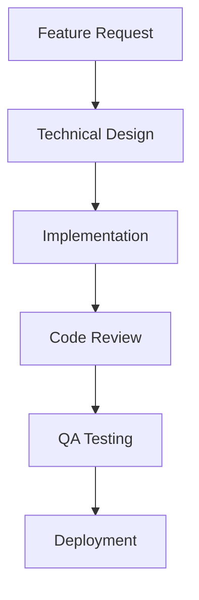

# Team Development Guidelines

## Role Assignment & Responsibilities

### Frontend Team
- **UI/UX Developers**
  - Implement responsive UI components
  - Ensure cross-browser compatibility
  - Maintain design system consistency
  - Optimize performance and loading times

- **Frontend Architects**
  - Design component architecture
  - Manage state management solutions
  - Implement authentication flows
  - Handle API integrations

### Backend Team
- **API Developers**
  - Design and implement RESTful APIs
  - Manage database schemas
  - Handle data validation and security
  - Implement caching strategies

- **Infrastructure Engineers**
  - Manage deployment pipelines
  - Monitor system performance
  - Handle scalability concerns
  - Maintain security protocols

### Mobile Team
- **Mobile Developers**
  - Implement Capacitor integration
  - Handle native feature implementations
  - Ensure cross-platform compatibility
  - Optimize mobile performance

### QA Team
- **Test Engineers**
  - Write and maintain test suites
  - Perform integration testing
  - Validate feature implementations
  - Report and track bugs

## Development Workflow

### 1. Feature Development


### 2. Branch Strategy
- `main`: Production-ready code
- `develop`: Main development branch
- `feature/*`: Individual feature branches
- `hotfix/*`: Emergency fixes
- `release/*`: Release preparation

### 3. Code Review Process
1. Create feature branch
2. Implement changes
3. Run tests locally
4. Create pull request
5. Address review comments
6. Merge after approval

## Communication Channels

### Daily Standups
- Time: 10:00 AM IST
- Duration: 15 minutes
- Format: Virtual/Hybrid
- Focus: 
  - What was done yesterday
  - What will be done today
  - Any blockers

### Sprint Planning
- Frequency: Every 2 weeks
- Duration: 2 hours
- Focus:
  - Review previous sprint
  - Plan next sprint tasks
  - Assign story points
  - Set sprint goals

### Technical Discussions
- Platform: Discord/Slack
- Channels:
  - #frontend
  - #backend
  - #mobile
  - #devops
  - #general

## Best Practices

### Code Quality
1. Follow TypeScript best practices
2. Maintain consistent code style
3. Write comprehensive tests
4. Document complex logic
5. Keep components modular

### Git Commits
1. Use conventional commit messages
2. Keep commits atomic
3. Reference issue numbers
4. Write clear descriptions

### Documentation
1. Keep technical docs updated
2. Document API changes
3. Update README files
4. Maintain changelog

### Testing
1. Write unit tests
2. Implement E2E tests
3. Perform manual testing
4. Document test cases

## Environment Setup

### Local Development
```bash
# Clone repository
git clone https://github.com/yourusername/car-rental-app.git

# Install dependencies
npm install

# Set up environment
cp .env.example .env.local

# Start development server
npm run dev
```

### Testing Environment
```bash
# Run tests
npm run test

# Run specific tests
npm run test:unit
npm run test:e2e

# Generate coverage report
npm run test:coverage
```

## Deployment Process

### 1. Staging Deployment
- Automatic deployment from `develop` branch
- Environment: Staging servers
- URL: staging.carrental.com

### 2. Production Deployment
- Manual deployment from `main` branch
- Environment: Production servers
- URL: carrental.com

### 3. Hotfix Deployment
- Emergency fixes to production
- Requires senior developer approval
- Immediate deployment after testing

## Monitoring & Maintenance

### Performance Monitoring
- Track page load times
- Monitor API response times
- Check server resources
- Analyze user metrics

### Error Tracking
- Use error tracking tools
- Monitor error rates
- Track user-reported issues
- Analyze error patterns

### Security
- Regular security audits
- Dependency updates
- Access control reviews
- SSL certificate maintenance

## Contact Information

### Team Leads
- Frontend: [Name] (email@example.com)
- Backend: [Name] (email@example.com)
- Mobile: [Name] (email@example.com)
- QA: [Name] (email@example.com)

### Support
- Technical: tech@carrental.com
- DevOps: devops@carrental.com
- Security: security@carrental.com
